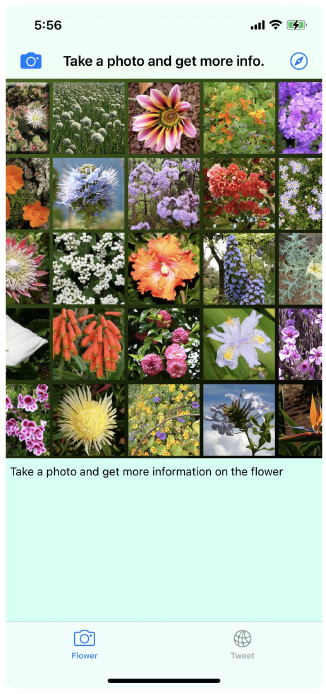
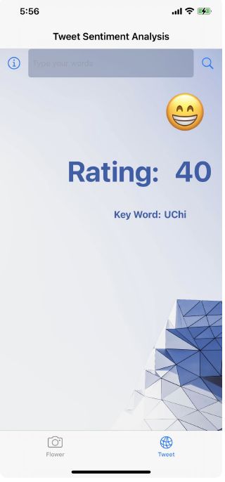
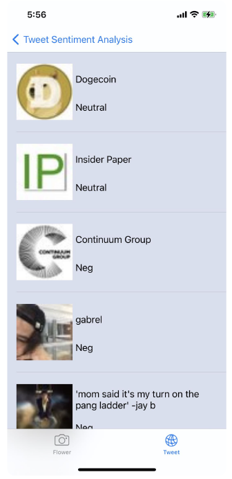
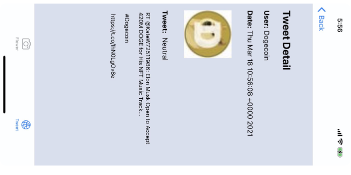

## Twiflower
### Author: Yongfei Lu
### Date: March 18th, 2021

## Summary:
	Twiflower uses AI to recognize flowers around and help you gain knowledge 
	of the flowers from Wikipedia. Moreover, it can conduct a sentiment analysis
	on the most recent tweets concerning the keywords user provides. It helps 
	users know what people are thinking of the issues recently.

## Key Features:
	Twiflower uses AI to recognize flowers around and help you gain knowledge of the
	flowers from Wikipedia. Moreover, it can conduct a sentiment analysis on the most
	recent tweets concerning the keywords user provides. It helps users know what 
	people are thinking of the issues recently.

## Technical Details:
	1. The flower recognition part recognizes the flower photos taken by the users by 
	applying the flower classifier machine learning model, then uses the result 
	(flower name) to fetch relevant information from the wikipedia pages. It also 
	provides a window for users to see more information via going through the safari 
	browser.
	
	2. The tweet sentiment analysis part fetches the most recent 100 tweets concerning 
	the keywords provided by the users through Twitter standard APIs, then conduct 
	sentiment analysis on these tweets via the NLP model trained before, and finally 
	delivered a emotional score as the result.

## Third-Party Framework:
	In this app, we use Cocoapods to incorporate Alamofire, SwiftyJSON, and SwifteriOS 
	to deal with the data we fetch from the APIs. Alamofire helps request and organize 
	the data we get from the the Wikipedia API：https://en.wikipedia.org/w/api.php, 
	SwiftyJSON helps parse JSON data from the APIs we use,) SDWebImage helps load images 
	from the APIs, and SwifteriOS helps work with Twitter standard APIs (searching and 
	filtering tweets according to our demands). We also use Reachabilityto keep track of 
	the Internet connection, which is required to use the app.

## Demo:

### Lauching Page

### Flower Recognition

### Tweet Analysis

### Tweet Analysis Table View

### Tweet Analysis Detail View

	

